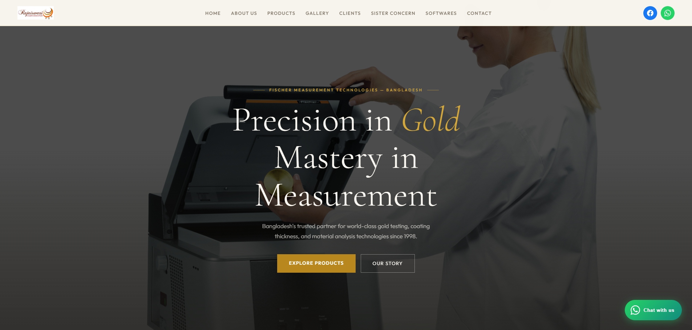

# Rajaiswari — Official Brand Website

[)

Official website for **Raj Aiswari**, Bangladesh's trusted partner for gold testing and precision measurement technology since 1998. They are the authorized representative of **Fischer Measurement Technologies (Germany)** in Bangladesh, serving 500+ clients with world-class instruments from Germany, Italy, Switzerland, Hong Kong, and Turkey.

This website was custom-built by me for the Raj Aiswari brand to establish their online presence — showcasing their products, global partnerships, client testimonials, and making it easy for customers to reach them.

## Built With

- **Frontend:** HTML5, CSS3, JavaScript
- **Backend:** PHP
- **Hosting:** cPanel — [rajaiswari.com](https://rajaiswari.com/)

## Features

- Fully responsive across mobile, tablet, and desktop
- Product catalogue with inquiry system
- WhatsApp live chat integration
- Partner & client showcase
- Contact form with PHP backend
